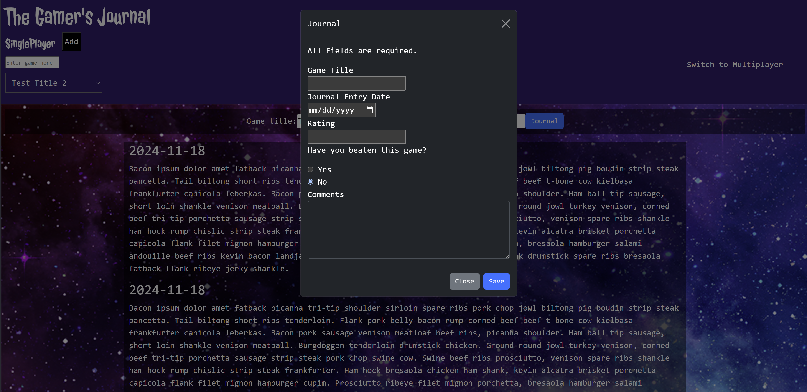

# The Gamer's Journal

## Description

Have you ever been in the middle of a game and you have to be a responsible adult and do responsible adult things? This product is for you. Are you a competitive gamer and want to have a cohesive record of your game play over time, perhaps with some video footage mixed in? The product is also for you!

The biggest challenge in putting this piece together was learning to work as a team and learning how to communicate with that team. From a technical perspective, it teaches much about how to construct your data for later use, how to retrieve that data and how to use that data across a number of functions. Moreover, this also teaches about how to make sure that the right data is displayed at the right time.

## Installation

No installation required. This can be found by navigating to https://johnbrunson.github.io/the-gamers-journal/. Please note that any data is saved to your local storage. If you clear your cache, the data goes with it. 

## Usage
- Navigate to https://johnbrunson.github.io/the-gamers-journal/
- Click on Journal

- Make an entry.
- Click Save, then close
- NOTE: You'll need to refresh the page to see the additions. This bug should be fixed in future iterations.

To review entries already made:
- Select the game title 

- The screens will populate with your saved data.

NOTE: The Text Boxes Game Value does not do anything in terms of input. It is simply for display purposes only. This will probably be addressed in a future iteration.

The journal can keep track of single player games, multiplayer games, or both.

## Credits

### Collaborators
|Name       | Link  |
|-----------|-------|
|Matt Aceves|https://github.com/mmaceves|
|Bowman Crego|https://github.com/bowman-crego|
|Leo Jones|https://github.com/Finnmos1|

- Bootstrap was used for Modal
